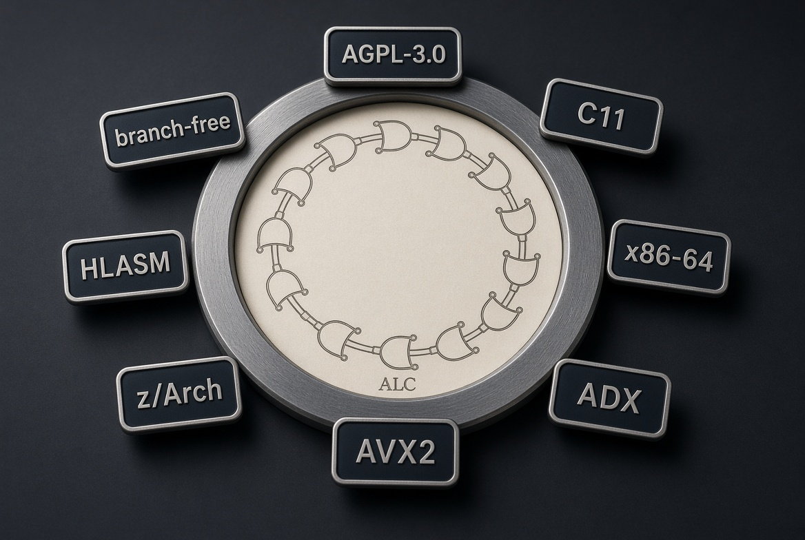

# alp-carry

Copyright (C) 2026 Ahmad Ali Parr

[](LICENSE)
[](src/host/host.c)
[](src/kernels/carry_x86.nasm)
[](src/host/dispatch.c)
[](src/kernels/proof_masks.c)
[](src/kernels/carry_z.hlasm)
[](src/kernels/atomized.c)



alp-carry is a vertical compiler for a small class of constraint proofs. An offline inducer turns examples into a Horn program. An atomizer bakes that program into masks and constants. A kernel then evaluates the body as a carry deficiency count: residue zero means every literal held, and the head mask is the verdict. If nothing fired, the identity word is selected. That last step is the forced-totality clause, `solve(N, N) :- true.`

The hot path is C11 and assembler. It does not interpret clauses, does not call into a logic runtime, and does not branch on the data. Owl, Janet, and the life-node bridge sit beside that path for synthesis and telemetry. They are not on the nanosecond proof.

This program is free software under the GNU Affero General Public License v3.0, and only that license. See `LICENSE`. A network service that runs a modified copy must offer the corresponding source to its users.

## What the stack is for

The problem is a refine step after a numeric layer. A neural output is a vector. A symbolic layer wants that vector inside a clamp, or inside an epsilon ball of a candidate, or left alone when no clause applies. Doing that with a Horn-clause interpreter costs a unification and a dispatch per call. alp-carry moves the interpretation to synthesis time. At runtime the only thing left is a mask encoder, a carry kernel, and a store.

The induced program is total. ALP hypotheses cover the examples they were shown. The force step adds the identity clause so a vector that matches nothing still produces an output. Identity is the top of the refinement lattice used here: the fallback copies the neural word and does not invent a tighter one.

The same idea is compiled twice. `atomic_solver_ref` is the portable scalar model. `alp_carry_prove` is the fast path. The verifier refuses to run the host if those two disagree on the emitted vectors.

## Layout

```
LICENSE                         GNU AGPL-3.0
assets/logo.jpg                 emblem and badges
src/alp/examples_gen.py         DSPy-shaped examples
src/alp/alp_engine.py           saturate, generalize, force, minimize
src/atomizer/atomizer.py        constants, mask encoder, vectors
src/atomizer/templates.py       C emission templates
src/kernels/carry_x86.nasm      ADX deficiency chain
src/kernels/carry_portable.nasm ADC deficiency chain
src/kernels/carry_z.hlasm       z/Architecture sketch
src/kernels/atomized.c          scalar golden model
src/kernels/proof_masks.c       AVX2 encoder, generated
src/host/dispatch.c             CPUID trampoline
src/host/host.c                 forward, prove, converge
src/host/verifier.c             4096-vector gate
src/lifenode/lifenode.mjs       optional binary bridge
```

`make` uses NASM when it is on `PATH`, and the GAS twins otherwise. The objects export the same symbols.

## Induction

`examples_gen.py` writes five hundred triples. Each triple is a neural vector, a clamp and an epsilon, and the refined vector a ground-truth solver would emit. The seed is fixed, so the induced constants are reproducible.

`alp_engine.py` does four passes. Saturate builds the most specific clause that covers one example: a clamp literal if the refined value sits on the clamped neural value, a projection literal if it sits inside the epsilon ball. Generalize anti-unifies the bounds across examples, taking the min lower bound and the max upper bound per dimension, and the max epsilon. Force widens those bounds so the identity clause is the rare path. Minimize drops the projection literal when epsilon is at least the widest clamp span, which is condition C4.

The machine-facing artifact is `induced.json`. The human-facing artifact is `induced.pl`, two clauses at most:

```
solve(N, R) :- clamp_all(N, R), project_eps(N, R).
solve(N, N) :- true.
```

Coverage is printed. On the seeded set the induced program covers every example, because the bounds were widened to the example bounds. That is totality of termination, not a claim about unseen regions. Unseen regions hit identity until the next synthesis.

## Atomizer

`atomizer.py` reads `induced.json` and writes three files.

`generated_constraints.h` holds `ALP_LO`, `ALP_HI`, `ALP_EPS`, and `ALP_HAS_PROJECTION`. Floats are quantized through float32 and printed with nine significant digits, so the C constants and the verification vectors are the same numbers.

`proof_masks.c` is the AVX2 encoder. Eight lanes at a time, compare against the bounds, `movemask` into eight bits, shift those bits to dimension `j`. A clamp word is full if and only if every dimension is inside its interval. A projection word is full if and only if every dimension is inside the epsilon ball. `alp_encode_proofs` returns one or two words. Two is under the C2 cap of 63, so no bridge literal is emitted. A longer body would be split, and the subchain predicate re-encoded as one full or empty word.

`test_vectors.json` holds 4096 vectors: interior, on-bound, and strictly outside. The outside samples step at least `1e-4` past the float32 bound, so a value cannot land on the bound by accident and be labeled adversarial.

## The entailment predicate

A summing carry chain is the wrong conjunction. If the chain is primed with carry-in 1, a zero word becomes residue 1 and carry 0, and a later all-ones word wraps that residue back to 0 and raises carry again. The terminal state then matches the all-full state. The kernel does not do that.

Each proof word is compared to all-ones. The compare sets CF when the word is short. `ADC` or `ADCX` adds that CF into a deficiency count. The count only grows. A later full word cannot repair it. Residue 0 means every word was full. That is the verdict. The head mask is `0x8000000000000000`. Anything else selects the identity word `0xffffffffffffffff`.

The OF rail is a second pass of `ADOX` on the ADX kernel. It is not interleaved with the CF loop. On some implementations an `ADOX` between two `ADCX`s merges the flag writers, and a zero word is then ignored. The second pass keeps the rails independent without that hazard. The portable kernel has no OF rail. Both kernels still return the same verdict word and the same residue. The cross-check requires that.

C1: a word is admissible only as empty or full. The encoder is the producer. Partial masks reach the kernel only as failures, and they increment the deficiency count. C2: a body longer than 63 literals is split. C3: literals are threshold-shaped. A non-monotone literal has to be rewritten as a pair of comparisons before it is masked. C4: redundant literals are dropped offline.

## Dispatch

`alp_carry_prove` is the only symbol the host calls. The first call runs CPUID. GCC and Clang use `__builtin_cpu_init` and `__builtin_cpu_supports("adx")`. Other compilers read leaf 7, EBX bit 19. The function pointer is stored with an acquire/release atomic. Later calls are one indirect call.

The ADX object is linked either way. It is not entered unless the bit is set. Mapping the page is safe. Execution is the gate.

`carry_portable.nasm` is the same predicate with `ADC`. It runs on any x86-64. The ADX file is `carry_x86.nasm`, symbol `alp_carry_prove_adx`. GAS twins exist so a machine without NASM can still assemble.

## Host

`host.c` is the C11 process. Tensors are 64-byte aligned, rows padded to a cache line. `linear_avx2` is a dense layer: broadcast the input element, multiply-add eight weights at a time, scalar tail. The DSPy loop runs that layer, refines each row with the scalar model, and also encodes masks and calls the carry kernel. Loss is the squared gap between the activation and the refinement. The loop stops under `1e-4` or at 200 iterations.

Before any of that, `alp_verify_encoder` loads the 4096 vectors and checks the kernel verdict against the ground-truth clamp-full bit. Projection of a vector with itself is full whenever epsilon is non-negative, so body entailment equals the clamp bit. A mismatch aborts the process. The kernel is fixed. A mismatch is an encoder bug, and the object is not swapped in.

## Life node

`lifenode.mjs` is optional. It listens on a Unix socket. The frame is 16 bytes: type, id, length. Payloads are raw. A telemetry message whose verdict is the identity word is treated as the totality fallback dominating, and the node writes a resynthesis request. Constraint proposals are logged for the next offline ALP run. The socket is not on the proof path.

## z/Architecture

`carry_z.hlasm` is the same story on z. Carry is primed by an add that overflows, then `ALCG` walks the proof words. A carry-out at the end selects the head mask. No carry selects the identity word. Assemble it on z/OS or Hercules. It is not part of the x86 link.

## Build

```
make synthesize    # examples, induction, atomizer
make               # kernels and nnhost
make test          # both, then the suite
```

`make test` reruns synthesis so the header, the encoder, and the vectors match. The suite runs the host, which gates on the 4096 vectors, then a 100000-trial cross-check of the portable kernel, the ADX kernel, and the trampoline. A third check greps the host log for convergence.

Measured on one ADX host during development: the encoder gate passed 4096 of 4096, and the three entry points agreed on 100000 trials. Those are checks, not a performance claim. The design notes that used to quote nanosecond costs are not measurements from this tree.

## License headers

Source files carry a short header: copyright 2026 Ahmad Ali Parr, SPDX `AGPL-3.0-only`. The full text is `LICENSE`. Generated files are rewritten by the atomizer. The template is the place to keep the header, so a regeneration does not strip it.

You may convey verbatim copies if you keep the copyright notice, the license, and the absence of warranty. You may convey modified versions under AGPL-3.0, and if you run a modified version as a network service you must offer the corresponding source to users of that service. There is no MIT grant and no proprietary side license in this repository.

## What this does not do

It does not compile arbitrary Prolog. Recursion and unification stay off the carry path. It does not prove the inducer. The verifier checks the encoder and the kernel against the vectors the atomizer just wrote. It does not replace a theorem prover. The deficiency count is a decision procedure for full-mask conjunctions, which is the fragment the atomizer emits.

Identity on an uncovered input is a defined answer, not a verified constraint solution. If that fallback dominates, the life node asks for another synthesis. That is the adaptation loop. It is offline.

## Calling convention

The public entry is System V. `rdi` is the proof-word pointer, clause-major, one `uint64_t` per literal. `rsi` points at two words of output: verdict, then residue. `edx` is the literal count. `n` may be zero, in which case the kernel stores the identity word and a zero residue without entering the loop. Callee-saved registers used by the ADX path are saved and restored. The portable path uses only caller-saved registers aside from the arguments.

The residue is the deficiency count, not a popcount of the masks. A caller that wants the masks themselves already has them: the encoder wrote them. The residue is the feedback the DSPy loop can log. Zero means the body held. A positive count means that many literals were short. The life node does not parse the count. It only watches for the identity verdict.

## Worked fragment

Take two dimensions and a clamp of `[-1, 1]` on both, and ignore projection. The neural word `(0.2, -0.4)` is inside both intervals, so the clamp mask is `0b11` in the low bits and, once the encoder has filled all 64 positions, all-ones. The kernel compares that word to all-ones, CF stays clear, the deficiency count stays 0, and the verdict is the head mask.

The neural word `(0.2, 1.4)` fails dimension 1. Bit 1 of the mask is clear. The compare sets CF, the add increments the residue, and the verdict is the identity word. The scalar model still returns a clamped value. The kernel does not return the clamped floats. It returns the proof. The host stores both: the refined row from the scalar model, and the verdict from the kernel. They are answers to different questions. The verifier is what keeps them from drifting apart.

## Applying the license

Drop a copyright and SPDX line at the top of each file you add. Point readers at `LICENSE`. Do not add a second license to the same file. If you ship a binary, ship the corresponding source, including the atomizer output that the binary was built from, because those constants are part of the work. If you run a modified `nnhost` or life node as a service, AGPL-3.0 section 13 applies: users interacting with that service remotely get the source of the version you are running.

The emblem in `assets/logo.jpg` is part of this repository and is covered by the same license. The badge text on the bezel is descriptive, not a trademark grant.

## Operators

Research: Ahmad Ali Parr. The program is the work. The license is AGPL-3.0.

